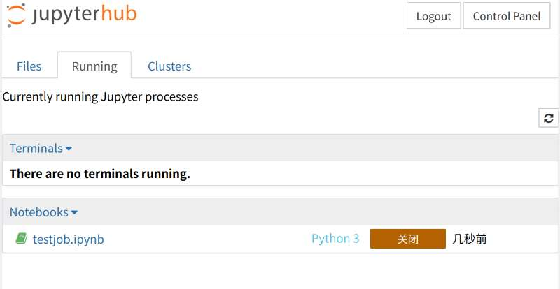

# Jupyter

You can start your own jupyter-notebook on the login node.

# Jupyter hub
Jupyterhub is available at [https://gravity.sjtu.edu.cn](https://gravity.sjtu.edu.cn)

Note the "s" in "https".

```note
Some browsers show warning about the invalid certificate.  You may manually chose "allow", "trust" or "visit the website" in the settings/permissions/privacy options.

For Safari, click "show details" in the warning page and click "visit the website"
```
# Specify the default python kernel to use module loaded python

By default, the jupyter-notebook use the system python installation as the backend kernel, which may have some functionality/compatibility issues. These are usually resolved by replacing it with the python in the modules. 

For example, to use the module python2 as the default python2 kernel for jupyter:

```bash
module load python/python-2.7.18
ipython kernel install --user --display-name "Python Module 2.7.18"
```
This will creat or overwrite the config file at `~/.local/share/jupyter/kernels/python2`.  Now open a new python notebook, and select the `Kernel->change kernel` menu, you will see the newly configured kernel there.

# Add your own virtual env into Jupyter Notebook

To do so, you need *ipykernel* package installed in your virtual environment.

Assume that you have created your own virtual environment named *MYENV* and activated.

Install *ipykernel*, `pip install ipykernel` .

Then configure it 
`python -m ipykernel install --user --name MYENV --display-name "abc"`

The virtual environment *MYENV* is shown as *abc* in your jupyternotebook.

[//]:


# 在计算节点运行jupyter notebook

前期准备：拥有自己的conda环境，并且环境中安装配置了jupyter netobook。

创建文件`touch jupyternotebook.pbs`,并编辑文件

例如：
```bash
#PBS -N jupyternotebook
#PBS -l nodes=1:ppn=1
#PBS -q normal
#PBS -V
#PBS -S /bin/bash
#PBS -l walltime=71:00:00 
### Set intel environment###

module load anaconda/anaconda3
conda activate inspur03

nohup jupyter notebook >jupyternotebook.file 2>&1 &

sleep 6000
```
把`inspur03`换成自己的conda环境，`sleep 6000`过60分钟后任务结束，可以自己调节。使用`qsub ./jupyternotebook.pbs`提交脚本

然后查看生成的`jupyternotebook.file`文件，可以使用`cat jupyternotebook.file | grep http`命令看到jupyter notebook运行的计算节点和端口
```bash
[inspur03@login02 ~]$ cat jupyternotebook.file | grep http
[I 10:42:14.172 NotebookApp] http://gr32:18890/
```
然后在本地打开一个新的远程界面，输入`ssh -L 2567:gr32:18890 user@gravity.sjtu.edu.cn -fN`,(`2567`是本地端口可以自定义。`gr32:18890`是jupyter notebook自动生成的计算节点和端口，`user`是用户名，`gravity.sjtu.edu.cn`登录节点网址)

打开本地浏览器输入`http://localhost:2567`就可以打开jupyter notebook了（`注意：使用http，不要使用https`）

# 在jupyterhub关闭已经结束的python进程

请记住关闭已经停止运行的python进程，它会消耗大量的内存，通过点击关机按钮关闭，登录jupyterhub网址:[https://gravity.sjtu.edu.cn](https://gravity.sjtu.edu.cn)
如下图所述：

[//]:


如果你需要需要内存很大并且时间较长的jupyter、ipython程序，可以通过提交interactive job在计算节点进行，或者改写成python脚本直接提交。

